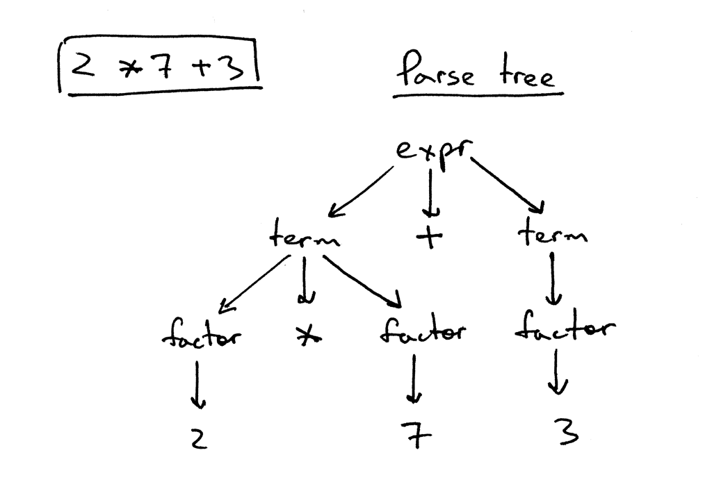
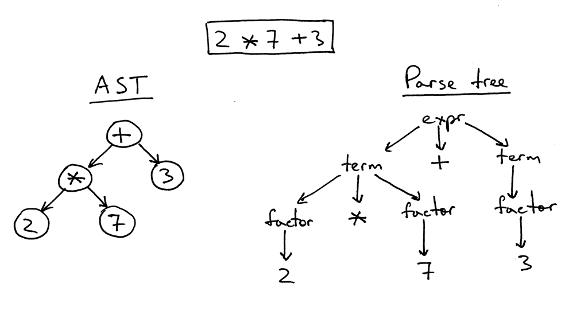

- until now parser and interpreter code mixed -- interpreter evaluated expression as soon as parser recognized it --
  this is called **syntax directed interpreter**
- for more complex applications we need to build **immediate representation** (IR)
- **parse-tree** (concrete syntax tree) is a tree that represents syntactic structure of a language construct according
  to our grammar definition, example:
  
- **abstract syntax tree** represents abstract syntactic structure of a language construct 
    - ASTs uses operators/operations as root and interior nodes and it uses operands as their children.
    - ASTs do not use interior nodes to represent a grammar rule, unlike the parse tree does.
    - ASTs don’t represent every detail from the real syntax (that’s why they’re called abstract) - no rule nodes and no
      parentheses, for example.
    - ASTs are dense compared to a parse tree for the same language construct.

- ASTs are evaluated by a special case of depth-first traversal -- **postorder traversal**
  ```
  def visit(node): 
    for child in node.children:
        visit(child)
    # postorder actions
  ```
  we need postorder because:
    - we need to evaluate children lower in tree because they represent higher precedence operations
    - we need to evaluate operands before operators (which we then apply to operands)

- **recursive-descent parser** is a top-down parser that uses a set of recursive procedures to process the input.
  Top-down reflects the fact that the parser begins by constructing the top node of the parse tree and then gradually
  constructs lower nodes